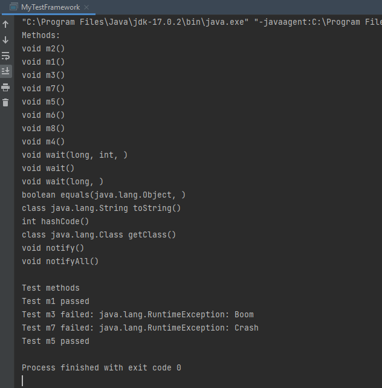

Lab 12

Reflection

Create an application to analyze and test java classes.

The application will receive as input java classes and it will display their prototypes and perform the tests specified by the @Test annotation.

The main specifications of the application are:

Compulsory (1p)

- [x] The input will be a .class file, located anywhere in the file system.
- [x] Load the specified class in memory, identifying dynamically its package.
- [x] Using reflection, extract as many information about the class (at least its methods).
- [x] Using reflection, invoke the static methods, with no arguments, annotated with @Test.

Example of output:

